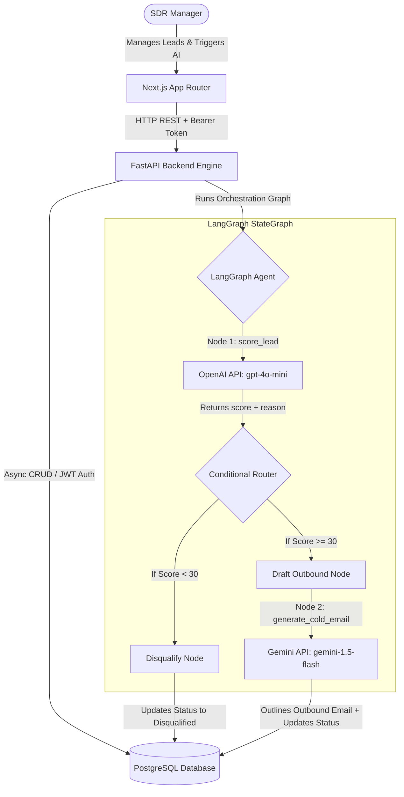

# Mini AI SDR Application

A fully integrated, production-grade prototype for an automated Sales Development Representative (SDR) pipeline. The application leverages **LangGraph** to coordinate **OpenAI** lead evaluation and **Google Gemini** cold email drafting, feeding all results into a PostgreSQL relational database. Users manage the pipeline through a modern, responsive **Next.js (App Router)** client dashboard.

---

## System Architecture



---

## Features

- **JWT-Protected Workflows**: Registration, login, and bearer authorization token verification.
- **Relational Leads Storage**: Full CRUD capabilities mapped to PostgreSQL.
- **LangGraph Agentic Orchestration**:
  - **Lead Scoring**: Evaluates lead profile (job title, company, email) via OpenAI `gpt-4o-mini` to score details (1-100) and explain why.
  - **Rule-Based Routing**: Auto-disqualifies cold leads with scores below 30 to prevent unwanted outreach.
  - **Outbound Copywriting**: Generates personalized emails using Gemini `gemini-1.5-flash` tailored to the lead's title and value assessment.
- **Sleek Client Dashboard**: Glassmorphic, dark theme layouts mapping leads list, dynamic copy-to-clipboard outreach viewports, loading statuses, and high-level campaign metrics.

---

## Folder Structure

```
mini-ai-sdr/
├── backend/
│   ├── app/
│   │   ├── api/
│   │   │   ├── auth.py          # Register & login routes
│   │   │   └── leads.py         # Lead CRUD & AI Orchestration route
│   │   ├── core/
│   │   │   ├── config.py        # Settings loader (Pydantic Settings)
│   │   │   └── security.py      # BCrypt password hashing & JWT helpers
│   │   ├── db/
│   │   │   ├── base.py          # SQLAlchemy Declarative base
│   │   │   ├── init_db.sql      # Raw SQL schema creation
│   │   │   └── session.py       # Async engine & session factories
│   │   ├── models/
│   │   │   └── lead.py          # SQLAlchemy models (User, Lead)
│   │   ├── schemas/
│   │   │   ├── auth.py          # Credentials verification schemas
│   │   │   └── lead.py          # Leads payload formatting schemas
│   │   └── services/
│   │       ├── openai_service.py # OpenAI lead evaluation service
│   │       ├── gemini_service.py # Gemini outbound email writing service
│   │       └── agent_service.py  # LangGraph Agent workflow compiler
│   ├── main.py                  # Entrypoint, CORS, & startup DB init
│   └── requirements.txt         # Backend Python dependencies
├── frontend/
│   ├── src/
│   │   ├── app/
│   │   │   ├── layout.tsx       # Next.js Root Layout
│   │   │   ├── login/
│   │   │   │   └── page.tsx     # Session Login form screen
│   │   │   └── dashboard/
│   │   │       └── page.tsx     # Primary pipeline dashboard
│   │   ├── components/
│   │   │   ├── LeadTable.tsx    # List and run AI buttons
│   │   │   ├── LeadModal.tsx    # Form dialog to add leads
│   │   │   └── EmailViewer.tsx  # Dynamic previewer and copy drawer
│   │   └── lib/
│   │       └── api.ts           # Client API fetch wrapper
│   ├── tailwind.config.ts
│   └── package.json             # Frontend React/Next.js dependencies
└── docs/
    └── Mini_AI_SDR_Postman_Collection.json
```

---

## Setup & Deployment Guide

### Prerequisites
- **Python**: v3.10 or higher.
- **Node.js**: v18.0 or higher.
- **PostgreSQL Database**: Running locally (e.g., via Docker) or hosted (e.g., Neon/Supabase).

---

### Phase 1: Backend Setup

1. **Navigate to the Backend Directory**:
   ```bash
   cd backend
   ```

2. **Configure Environment Variables**:
   Create a `.env` file using the example:
   ```bash
   cp .env.example .env
   ```
   Open `.env` and fill in your details:
   ```env
   DATABASE_URL=postgresql+asyncpg://<username>:<password>@<host>:<port>/<dbname>
   JWT_SECRET=use_a_strong_random_signing_key_here
   OPENAI_API_KEY=sk-proj-...
   GEMINI_API_KEY=AIzaSy...
   ```

3. **Install Dependencies**:
   Create a virtual environment and install requirements:
   ```bash
   python -m venv venv
   # On Windows:
   .\venv\Scripts\activate
   # On macOS/Linux:
   source venv/bin/activate
   
   pip install -r requirements.txt
   ```

4. **Initialize Database Schemas**:
   - **Automatic Method**: The backend is configured to automatically inspect models and run schema creation (`Base.metadata.create_all`) on startup.
   - **Manual Method**: Run the raw SQL initialization script provided under `app/db/init_db.sql` on your PostgreSQL database instance:
     ```bash
     psql -h <host> -U <username> -d <dbname> -f app/db/init_db.sql
     ```

5. **Start the API Server**:
   Launch the FastAPI engine using Uvicorn:
   ```bash
   uvicorn main:app --reload --host 127.0.0.1 --port 8000
   ```
   The API docs will be available at `http://127.0.0.1:8000/docs`.

---

### Phase 2: Frontend Setup

1. **Navigate to the Frontend Directory**:
   ```bash
   cd ../frontend
   ```

2. **Configure Environment Variables**:
   Create a `.env` file using the example:
   ```bash
   cp .env.example .env.local
   ```
   Ensure it points to the correct backend address:
   ```env
   NEXT_PUBLIC_API_URL=http://localhost:8000/api
   ```

3. **Install Client Dependencies**:
   Install necessary packages:
   ```bash
   npm install
   ```

4. **Run the Next.js Client in Development Mode**:
   Start the development server:
   ```bash
   npm run dev
   ```
   Open `http://localhost:3000` in your browser to view the application workspace.

---

## Verifying & Testing the API

To verify endpoint operations without the frontend client, import `docs/Mini_AI_SDR_Postman_Collection.json` into Postman:

1. **Set Environment Variables**:
   Set `baseUrl` in Postman to `http://localhost:8000`.
2. **Register a User**:
   Trigger `POST /api/auth/register` to save test credentials.
3. **Log In**:
   Trigger `POST /api/auth/login`. The test script inside the collection automatically captures `access_token` and sets `authToken` variables.
4. **Create a Lead**:
   Trigger `POST /api/leads` to insert a new profile.
5. **Run AI Agent Workflow**:
   Trigger `POST /api/leads/{id}/qualify` replacing the `:leadId` parameter with the database ID. Check response scores, justifications, and cold email copy.
